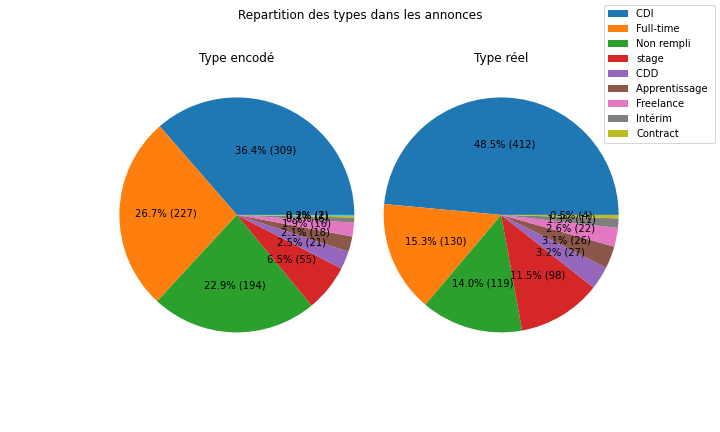
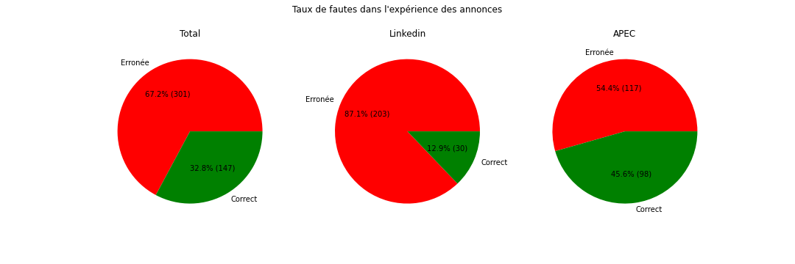

# Jobs_quality

### Une enquête sur la qualité des annonces d'emploi en France

1 Scraping de 3 sites d'annonces d'emploi
2 tri et nettoyage
3 Analyse graphique

Le marché de l'emploi semble etre dans un mauvais état. Mais qu'en dit les données ?

## Phase de Scrapping

J'ai décidé de récupérer les données de trois sites d'emploi sur internet : 
 - Indeed
 - Linkedin
 - APEC

Chacun des sites présente une façon différente de ranger ses annonces, et donc un challenge different à surmonter :  

Indeed n'a besoin que de navigation avec l'utilisation de selenium pour récupérer les données.

Linkedin présente l'inconvéniant de passer un logwall. Il est cependant possible de le passer avec un navigateur automatisé.

L'APEC est le plus simple puisqu'il suffit d'utiliser la librairie requests pour requeter des pages pour recevoir ce qu'elle contiennent sans passer par naviguateur.

Une fois une quantité relativement correctes d'item collectés (environ 300 par site). On peut jeter un oeil aux données.

## Tri et nettoyage

Sachant qu'ils viennent de sites différents, la premiere chose à faire est d'uniformiser les données.

J'ai décidé de partir sur une liste de catégorisation qui me semble plutot exaustive : 
- L'intitule du poste
- L'entreprise
- Le type de contrat 
- L'experience demandée
- Le texte de l'annonce
- Le site
- Le salaire proposé

Après un nettoyage et une normalisation, on aggrège toutes les donnéese en un seul dataframe que l'on va pouvoir analyser.

## Analyse

Spontanément, on peut se poser plusieurs questions : 

Quels sont les types d'emploi proposés ? 

Quelle est l'expérience moyenne demandée ? 

Quel est le taux d'erreur dans les annonces ? (par exemple une annonce indéxée en CDI qui est en fait un stage, ou un entry job avec 3 ans d'expérience demandé)

Après une analyse de texte, on arrive à determiner avec une précision relative (l'important est l'ordre de grandeur) la réalité des offres.

### Note: les duplicatas

Il s'agit simplement d'annonces postées plusieurs fois.

On peut voir que plus de 20% des annonces sont postés plus d'une fois, les raisons peuvent etre multiples : 

- Repost après qu'une salve de candidats ne soit pas pris,
- Repost par des bots, qui polluent les site avec des annonces qui ne sont plus à jour,
- Fausses annonces qui consistent à sonder le marché de l'emploi

Un écriture plus soignée des annonces en premier lieu pourrait permettre de réduire cette part.

### Quels sont les types d'emploi proposés ? 

Premier point délicat, les types d'emploi encodés dans les annonces ne sont pas forcément les véritables types. Un travail de recherche s'est imposé.

Certain sites ne repertorient pas de types de contrats, ou juste "temps plein", ce qui ne donne que trop peu d'indications.

Un exemple graphique : 

On peut voir naturellement une forte propention aux CDI.

### Quelle est l'expérience moyenne demandée ? 

* à finir

 
### Quel est le taux d'erreur dans les annonces ?

Il s'agit ici de comparer les informations du texte des annonces avec les informations encodés au sein des sites. Chaque site propose son systeme.

On va déjà comparer avec l'expérience demandée

Note = Indeed ne permet pas d'encoder de niveau d'expérience.

On peut remarquer un score mauvais pour Linkedin (Plus de 50%!).
Il peut etre expliqué par le fait qu'il s'agit du site le plus important, et donc le plus enclin aux erreurs. Je ne m'attendais cependant pas à un tel niveau.
L'APEC propose un système d'encodage plus fin, les erreurs vienent souvent du fait qu'il existe un encodage "tout niveaux acceptés", alors que ce n'est pas du tout le cas.

Linkedin propose un encodage "Débutant", qui demandent la plupart du temps une expérience d'au moins 2-3 ans

Mes quelques pistes de l'origine de ces erreurs sont :
- Des bots mal programés
- Des rédacteurs d'annonces qui ne prennent pas la peine de choisir des cases, soit par erreur, soit par manque de réalisme dans leurs attentes.

 
 
 